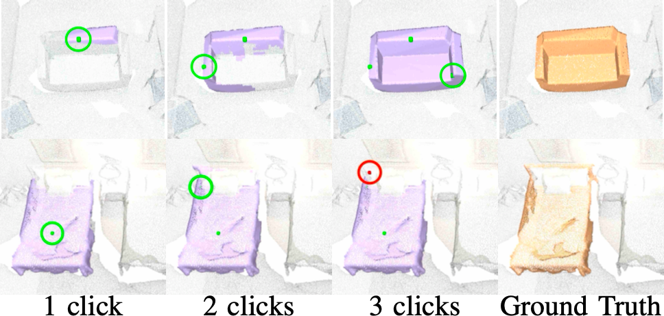

# Interactive Object Segmentation in 3D Point Clouds


<div align="center">
<a href="https://theodorakontogianni.github.io/">Theodora Kontogianni</a>, <a href="https://www.gfz-potsdam.de/staff/ekin.celikkan/sec14">Ekin Celikkan</a>, <a href="https://vlg.inf.ethz.ch/team/Prof-Dr-Siyu-Tang.html">Siyu Tang</a>, <a href="https://igp.ethz.ch/personen/person-detail.html?persid=143986">Konrad Schindler</a>

ETH Zurich


<!--  -->


</div>

This repository provides code, data and pretrained models for:

[[Paper](https://arxiv.org/abs/2204.07183)]

### Code
Inference code with pre-trained model is available - training code is coming soon

####Toy Data

Toy dataset can be found on: 
/home/kontogianni/Projects/ICRA23_InterObject3D/InterObject3D/Minkowski/training/mini_dataset/

### Citation
```
@article{kontogianni2022interObj3d,  
  author = {Kontogianni, Theodora and Celikkan, Ekin and Tang, Siyu and Schindler, Konrad},
  title = {{Interactive Object Segmentation in 3D Point Clouds}},
  journal = {arXiv},
  year = {2022},
  }
```
